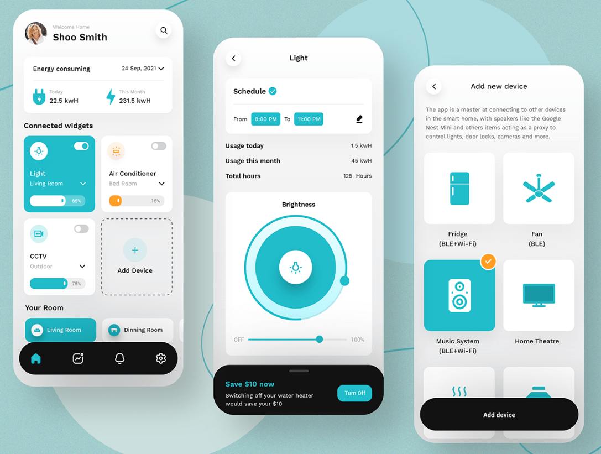

[](https://expo.dev/client)

# zaio-energy-saver

> Using this app, you can add a new device and schedule the device as you require which makes it comfortable for users.
> This is a coding challenge from [ZAIO](https://www.zaio.io/)'s mobile app development with React Native



Reduce the power consumption and cost through newly designed Energy Saver Mobile App by [CMARIX TechnoLabs](https://www.behance.net/CMARIXTechnoLabs) and implemented in React Native

## Built With

- JavaScript
- React Native
- Expo

## Getting Started

**This is an example of how you may give instructions on setting up your project locally.**

To get a local copy up and running follow these simple example steps.

### Prerequisites

- Nodejs
- yarn

### Setup

Navigate to your desired location to download the contents of this repository.
In order to clone this repository just type the following commands over the terminal in Linux or Mac or the Windows cmd console.

```s
git clone https://github.com/guillainbisimwa/zaio-energy-saver.git

```

### Install

Run the following commands to install dependencies:

```s
cd zaio-energy-saver
yarn install

```

### Usage

In order to run this project locally, just type this command:

```s
yarn start

```

### Run tests

In order to test this project locally, just type this command:

```s
npm test

```

### Deployment

If you choose to build for Android
When building for android you can choose to build APK

```s
expo build:android -t apk

```

or Android App Bundle

```s
expo build:android -t app-bundle

```

App bundles are recommended, but you have to make sure the Google Play App Signing is enabled for your project.

## Author

👤 **Guillain Bisimwa**

- Github : [@guillainbisimwa](https://github.com/guillainbisimwa)
- Twitter : [@gullain_bisimwa](https://twitter.com/gullain_bisimwa)
- Linkedin : [guillain-bisimwa](https://www.linkedin.com/in/guillain-bisimwa-8a8b7a7b/)

## 🤝 Contributing

Contributions, issues, and feature requests are welcome!

Feel free to check the [issues page](https://github.com/guillainbisimwa/zaio-energy-saver/issues).

## Show your support

Give a ⭐️ if you like this project!

## Acknowledgments

- [Energy Saver Mobile App Design](https://www.behance.net/gallery/128401225/Energy-Saver-Mobile-App-Design)
- [Zaio](https://zaio.io/)
- 👤[Didierson AMURI](https://github.com/didiamuri)
- 👤[Daniel rubambura](https://github.com/DanielRub)

## 📝 License

This project is [MIT](./MIT.md) licensed.
